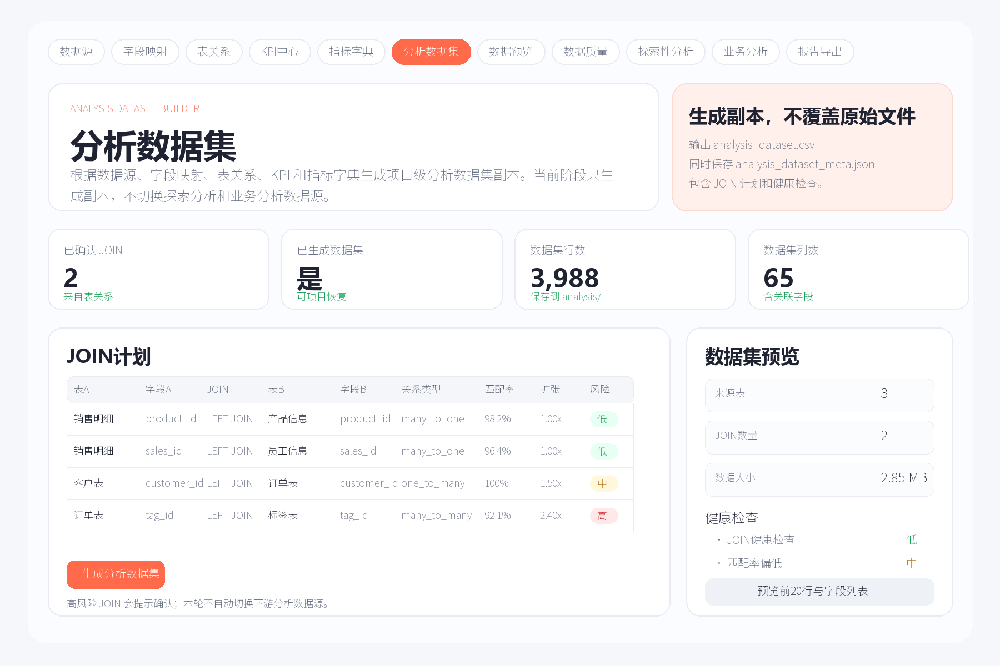
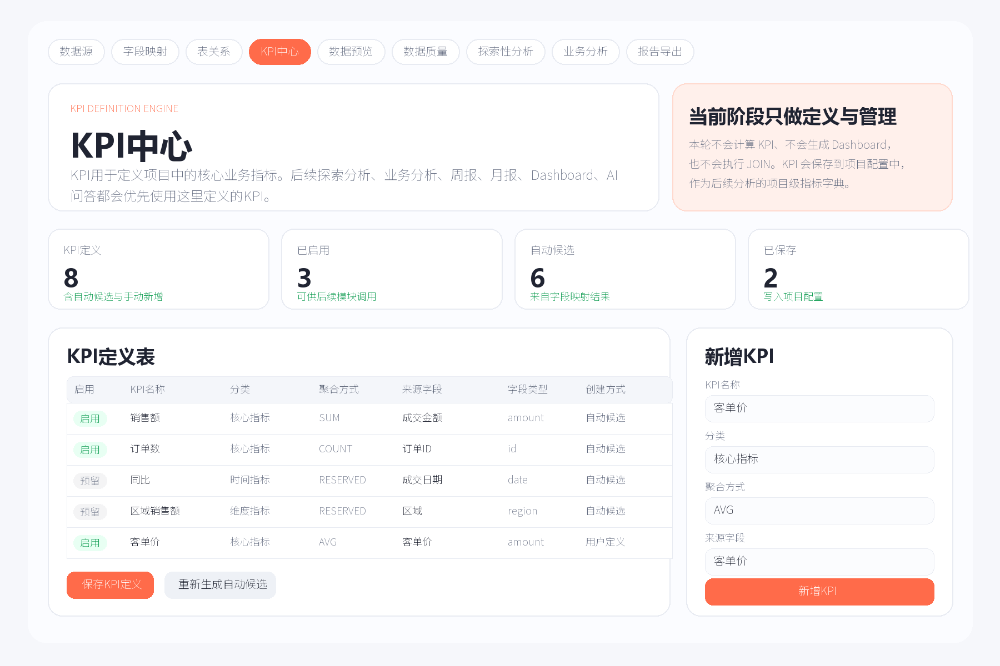
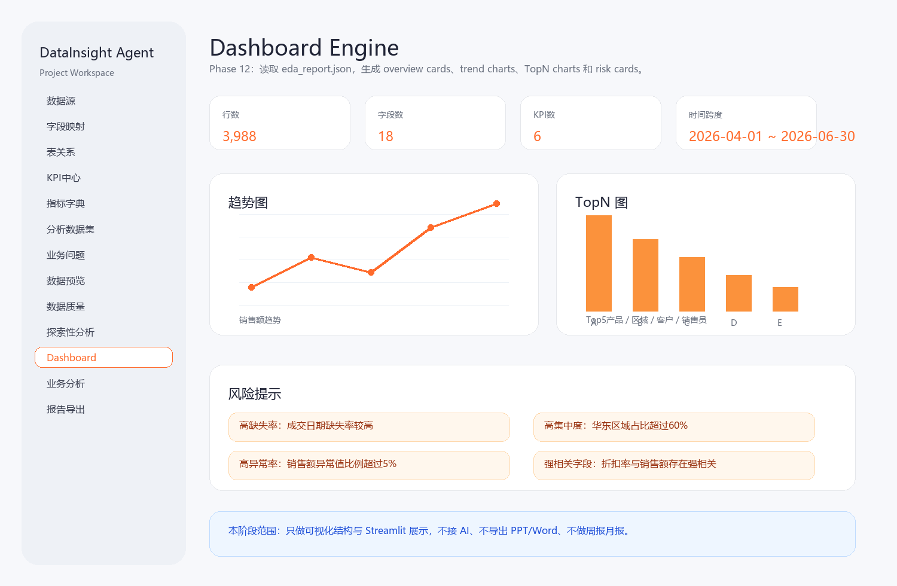
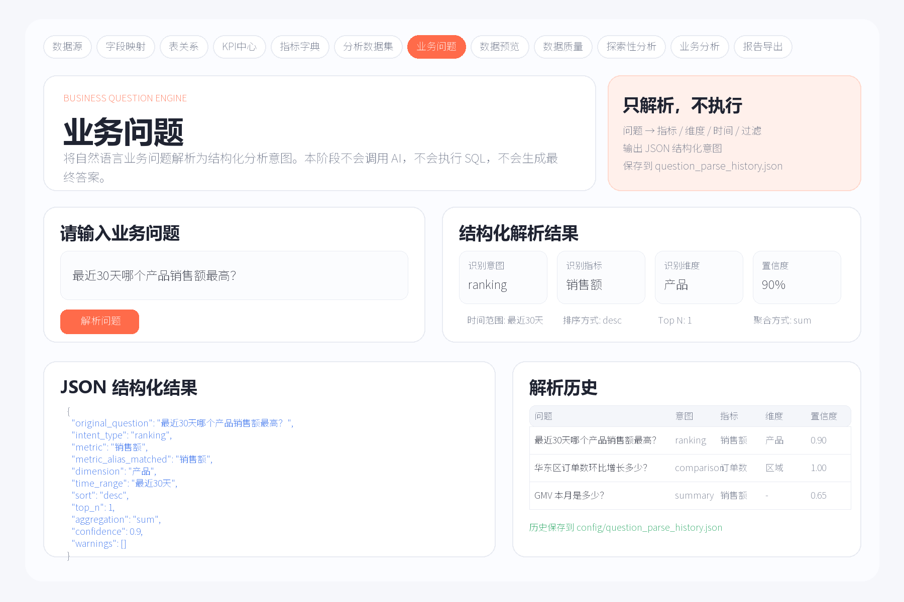

# DataInsight Agent（数据分析助手）

> 一款面向数据分析师、业务分析师及产品团队的 AI 数据分析助手。
>
> 从 Excel/CSV 数据上传，到数据质量检查、多表建模、探索分析、Dashboard 与报告导出，帮助用户完成完整的数据分析流程。

**Status：MVP 已完成，持续迭代中**

---

# 项目背景

日常数据分析通常需要在 Excel、Python、BI 工具之间频繁切换，数据清洗、指标管理、报表生成等流程分散，分析效率较低。

DataInsight Agent 将数据上传、数据质量检查、字段映射、表关系、多表分析、探索分析、业务分析、Dashboard 及报告导出整合到同一套 Streamlit 工作流中，帮助分析人员更高效地完成分析任务。

---

# 核心功能

✅ 数据上传与预览（CSV / XLSX / XLS）

✅ 数据质量检查
- 缺失值分析
- 重复值分析
- 异常值检测
- ID 字段识别
- 数据修复

✅ 多表数据建模
- 字段映射
- 表关系配置
- JOIN 计划生成
- 分析数据集构建

✅ KPI 中心
- KPI 管理
- 指标定义
- 自动候选字段
- 聚合方式配置

✅ 探索分析
- 描述统计
- 分类分析
- 相关分析
- 图表可视化

✅ Dashboard 与报告
- Dashboard 自动生成
- Excel 导出
- Word 导出
- AI 分析接口（支持用户自定义模型/API）

---

# 项目截图

## 数据分析集



---

## KPI 中心



---

## Dashboard



---

## 业务问题解析



---

# 技术栈

- Python
- Streamlit
- Pandas
- Plotly
- OpenPyXL
- Python-docx
- Python-pptx
- Pytest

---

# 项目亮点

我希望通过这个项目探索 AI 如何帮助分析师完成重复的数据处理工作，而不是替代分析师进行业务决策。因此整个产品围绕真实的数据分析流程设计，而非单独展示机器学习模型。

相比传统 Notebook 或单一分析脚本，本项目更关注完整的数据分析工作流设计。

目前已实现：

- 数据上传
- 数据质量管理
- 字段映射
- 表关系管理
- KPI 管理
- 分析数据集生成
- 探索分析
- Dashboard
- 业务问题解析
- 报告导出
- AI 模型配置（支持自定义 API）

整个流程围绕真实分析师的使用场景进行设计，而不仅仅展示单个算法或模型。

---

# 项目结构

```
DataInsightAgent/
│
├── app.py                  # Streamlit 入口
├── src/                    # 核心业务逻辑
├── templates/              # 导出模板
├── tests/                  # 单元测试
├── docs/                   # 产品文档与截图
├── outputs/                # 导出结果
└── workspace/              # 本地项目工作区
```

---

# 快速开始

```bash
python -m venv .venv

pip install -r requirements.txt

streamlit run app.py
```

推荐使用 Python 3.11 或 Python 3.12。

---

# AI 配置

AI 功能采用运行时配置。

用户可在应用界面中配置：

- API Key
- Base URL
- Model Name

不会将任何密钥写入仓库。

---

# 当前进度

✅ 已完成

- 数据上传
- 数据质量模块
- 字段映射
- 表关系
- KPI 中心
- 分析数据集
- Dashboard
- 报告导出
- AI 接口配置

🚧 持续开发中

- AI 自动分析
- Dashboard 模板扩展
- 更多数据源接入
- 企业级工作流优化

---

# 项目定位

本项目定位为个人作品集（Portfolio Project）。

重点展示：

- 数据分析产品设计能力
- Python 工程能力
- Streamlit 应用开发能力
- 数据建模与分析流程设计能力
- AI Agent 产品设计思路

---

# English Summary

**DataInsight Agent** is a Streamlit-based AI data analysis assistant designed for business analysts and product teams.

It integrates data upload, data quality inspection, relationship modeling, KPI management, exploratory analysis, dashboard generation, and report export into one analytics workflow.

This project is built as a portfolio demonstrating product thinking, Python engineering, and data analytics workflow design.

---
